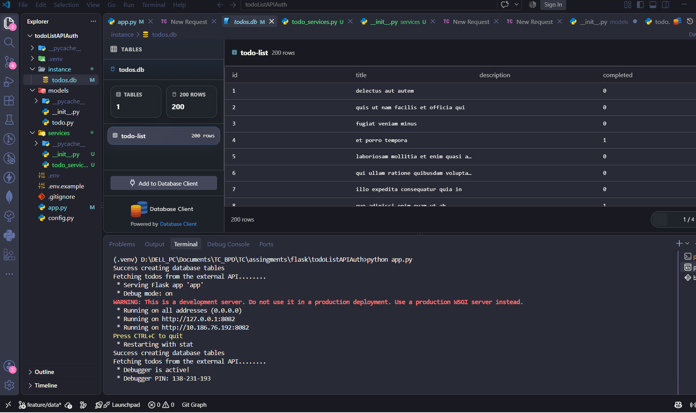
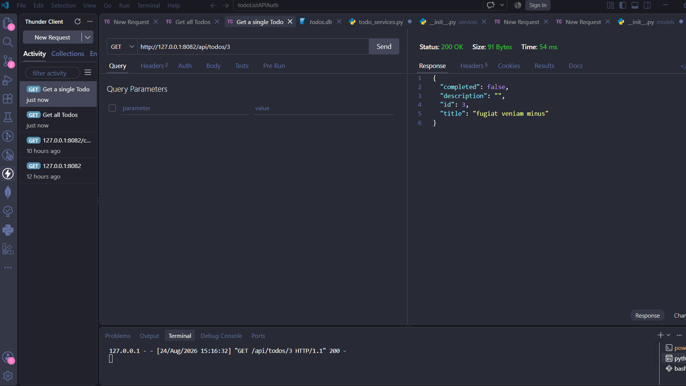
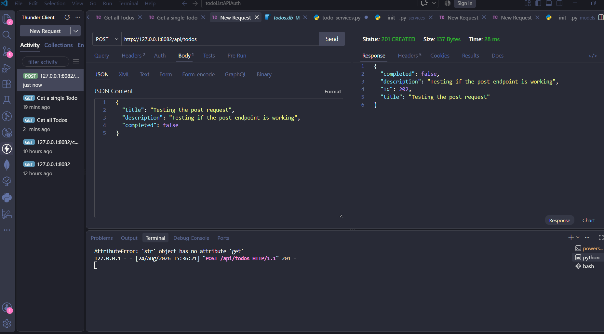
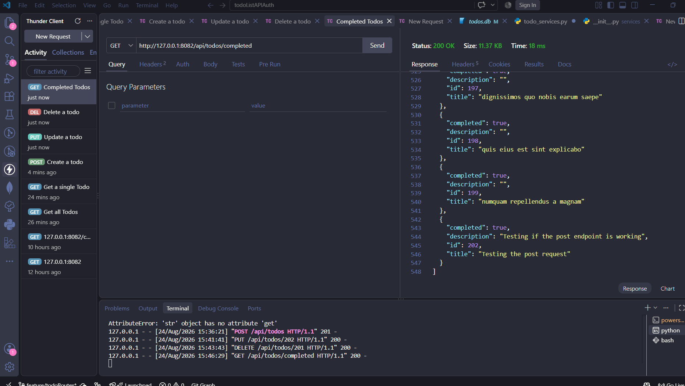
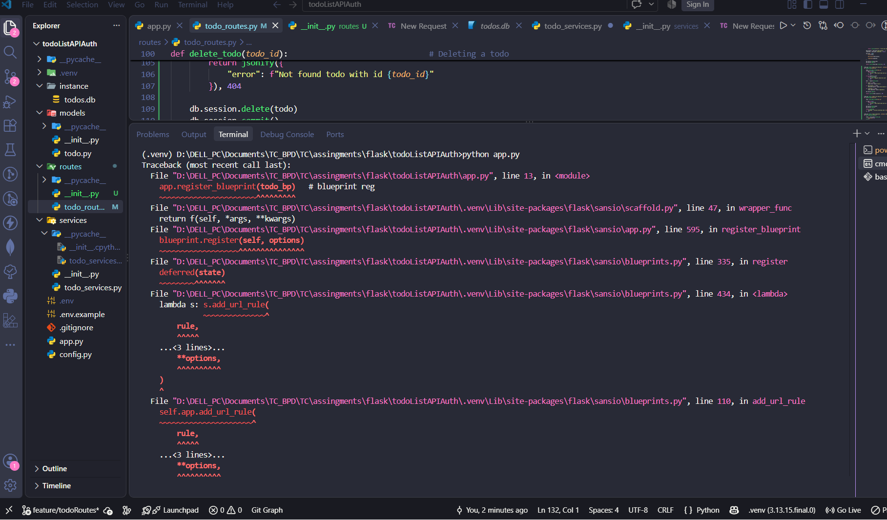
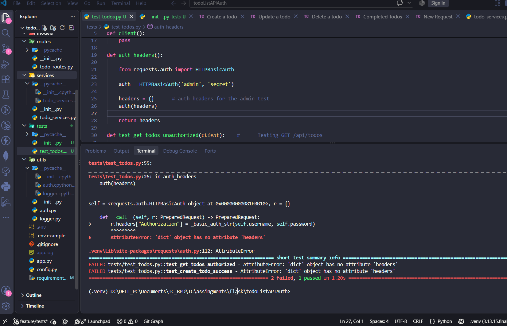

# Todo List API + Basic Authentication

A RESTful Flask API for managing todo items with basic authentication, built as a learning project during my Backend Course at Techcrush to demonstrate API development, authentication, external API integration, and testing


## About the Project

This is a simple but complete Todo List API that allows users to create, read, update, and delete todo items. The API uses HTTP Basic Authentication to protect all endpoints and includes features like filtering completed todos, logging requests, and fetching sample data from an external API on startup

This project was built as a learning exercise to understand REST API development with Flask, authentication, logging, and testing


## Features

- **CRUD Operations**. Create, read, update, and delete todos
- **Basic Authentication**. All endpoints protected with HTTP Basic Auth (admin/secret)
- **External API Integration**. Fetches sample todos from JSONPlaceholder on starting the server
- **Filtering**. Get only completed todos with `/api/todos/completed`
- **Request Logging**. All requests are logged to a file (app.log) using `before_request` hook
- **Error Handling**. Proper JSON error responses with appropriate status codes
- **Testing**. Basic test suite for API endpoints


## Technologies Used

- Python 3
- Flask
- Flask-SQLAlchemy (SQLite database)
- Flask-HTTPAuth (Basic Authentication)
- Requests (External API calls)
- Pytest (Testing)
- SQLite


## API Endpoints

- GET `/api/todos`  Get all todos 
- GET  `/api/todos/<id>` Get a specific todo 
- POST  `/api/todos`  Create a new todo
- PUT  `/api/todos/<id>`  Update a todo 
- DELETE  `/api/todos/<id>`  Delete a todo 
- GET  `/api/todos/completed`  Get only completed todos 


## How to Run the Project

1. Clone the repository: ``` https://github.com/TIZIHMARKP/todo-list-api-with-authentication.git ```

2. Create and activate a virtual environment

3. Install dependencies: ```pip install -r requirements.txt ```

4. Set up environment variables (Optional) by creating a .env file

5. Run the application: ```python app.py ```

6. Access the API at ```http://127.0.0.1:8082/api/todos``` and it requires authentication

7. Run the test suite using pytest: ```pytest```


## Screenshots

Here are some screenshots of the application during Development:














## Authentication

The todo API uses HTTP Basic Authentication with the following user hardcoded credentials:

| Username | Password |
|--------|----------|
| admin | secret |

All the api routes require authentication. If no user credentials are provided, the API is going to return a 401 Unauthorized response error message

## Logging

All incoming requests are logged inside the file app.log with the following information

- HTTP method
- Request path
- Client IP address

## Project Structure

This todoList project is organized into the following folders/modules

- app.py. It is the starting point and configuration of the app

- routes/ It contains the todo blueprint with all API routes

- models/ It contains the Database models (Todo model)

- services/ It contains the logic used to fetch External API 

- utils/ Contains the authentication and logging files

- tests/ Has the test suite file for endpoints

- instance/ It is the local data storage (SQLite database)

## Git Branching

This todoList project was built following the feature/branch workflow

- feature/data. Installation of packages, database setup and models setup
- feature/todoRoutes. Branch wher all CRUD operations were implemented
- feature/auth. Authentication branch
- feature/tests. Test suite implementation
- develop. All other feature/branchName are merged (integrated) into this branch
- main. Contains the final project with all features working as stated

## Acknowledgments

This project was completed as part of a learning assignment at TechCrush to practice building REST APIs with Flask. The sample data in the database was fetched from JSONPlaceholder

## License
This project is open source and it is available for anyone to use or contribute

---
 Tizih Mark Marko || PrinceWill
`Last Update: 25/08/2026`


